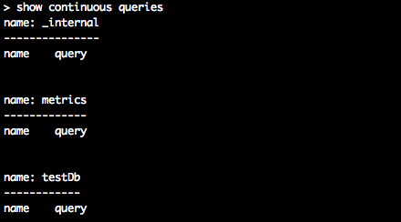

#Influxdb介绍：

influxdb是目前比较流行的时间序列数据库。
+ 何谓时间序列数据库？  
什么是时间序列数据库，最简单的定义就是数据格式里包含Timestamp字段的数据，比如某一时间环境的温度，CPU的使用率等。但是，有什么数据不包含Timestamp呢？几乎所有的数据其实都可以打上一个Timestamp字段。时间序列数据的更重要的一个属性是如何去查询它，包括数据的过滤，计算等等。

###**Influxdb**
  
Influxdb是一个开源的分布式时序、时间和指标数据库，使用go语言编写，无需外部依赖。  

它有三大特性：

1. 时序性（Time Series）：与时间相关的函数的灵活使用（诸如最大、最小、求和等）；
2. 度量（Metrics）：对实时大量数据进行计算；
3. 事件（Event）：支持任意的事件数据，换句话说，任意事件的数据我们都可以做操作。  

同时，它有以下几大特点：

+ schemaless(无结构)，可以是任意数量的列；
+ min, max, sum, count, mean, median 一系列函数，方便统计；
+ Native HTTP API, 内置http支持，使用http读写；
+ Powerful Query Language 类似sql；
+ Built-in Explorer 自带管理工具。

#Influxdb的安装和使用：

在讲解具体的安装步骤之前，先说说influxdb的两个http端口：8083和8086
+ port 8083：管理页面端口，访问localhost:8083可以进入你本机的influxdb管理页面； 
+ port 8086：http连接influxdb client端口，一般使用该端口往本机的influxdb读写数据。

##一、环境

&ensp;&ensp;Ubuntu 18.04.1 LTS

##二、安装

+ 下载文件：wget https://dl.influxdata.com/influxdb/releases/influxdb_1.2.2_amd64.deb
+ 安装文件：sudo dpkg -i influxdb_1.2.2_amd64.deb
<br/>安装完成，重启电脑

启动influxdb服务：sudo service influxdb start  
登录influxdb：出现下图内容，登录成功  


##三、使用
在具体的讲解influxdb的相关操作之前先说说influxdb的一些专有名词，这些名词代表什么。  

###influxdb相关名词

+ database：数据库； 
+ measurement：数据库中的表； 
+ points：表里面的一行数据。 

###influxDB中独有的一些概念

**Point由时间戳（time）、数据（field）和标签（tags）组成。**  
+ time：每条数据记录的时间，也是数据库自动生成的主索引； 
+ fields：各种记录的值； 
+ tags：各种有索引的属性。   

还有一个重要的名词：**series**  
所有在数据库中的数据，都需要通过图表来表示，series表示这个表里面的所有的数据可以在图标上画成几条线（注：线条的个数由tags排列组合计算出来）  

举个简单的小栗子：  
有如下数据：  
  

它的series为：  
  

###influxdb基本操作
+ 数据库与表的操作  
可以直接在web管理页面做操作，当然也可以命令行。  
```
#创建数据库
create database "db_name"
#显示所有的数据库
show databases
#删除数据库
drop database "db_name"
#使用数据库
use db_name
#显示该数据库中所有的表
show measurements
#创建表，直接在插入数据的时候指定表名
insert test,host=127.0.0.1,monitor_name=test count=1
#删除表
drop measurement "measurement_name"
```
+ 增  
向数据库中插入数据。  
+ 通过命令行  
```
use testDb
insert test,host=127.0.0.1,monitor_name=test count=1
```
+ 通过http接口  
```
curl -i -XPOST 'http://127.0.0.1:8086/write?db=testDb' --data-binary 'test,host=127.0.0.1,monitor_name=test count=1'
```
读者看到这里可能会观察到插入的数据的格式貌似比较奇怪，这是因为influxDB存储数据采用的是Line Protocol格式。那么何谓Line Protoco格式？

**Line Protocol格式：**写入数据库的Point的固定格式。  
在上面的两种插入数据的方法中都有这样的一部分：  

`test,host=127.0.0.1,monitor_name=test count=1`  

其中：

1. test：表名；
2. host=127.0.0.1,monitor_name=test：tag；
3. count=1：field  
想对此格式有详细的了解参见[官方文档](https://docs.influxdata.com/influxdb/v0.10/write_protocols/line/)

###常用http请求操作  
1. 建立数据库  
`curl -POST http://localhost:8086/query --data-urlencode "q=CREATE DATABASE mydb"`  
执行这个语句后，会在本地建立一个名为mydb的数据库。

2. 删除数据库
`curl -POST http://localhost:8086/query --data-urlencode "q=DROP DATABASE mydb"`  
其实使用HTTP API就是向 InfluxDB 接口发送相应的POST请求。  
将语句通过POST方式发送到服务器。

+ 查  
查询数据库中的数据。  
+ 通过命令行  
`select * from test order by time desc`  

+ 通过http接口  
`curl -G 'http://localhost:8086/query?pretty=true' --data-urlencode "db=testDb" --data-urlencode "q=select * from test order by time desc"`  

influxDB是支持类sql语句的，具体的查询语法都差不多，这里就不再做详细的赘述了。  

+ 数据保存策略（Retention Policies）  
influxDB是没有提供直接删除数据记录的方法，但是提供数据保存策略，主要用于指定数据保留时间，超过指定时间，就删除这部分数据。

+ 查看当前数据库Retention Policies  
`show retention policies on "db_name"`  

  

+ 创建新的Retention Policies  
`create retention policy "rp_name" on "db_name" duration 3w replication 1 default`  

```
- rp_name：策略名；
- db_name：具体的数据库名；
- 3w：保存3周，3周之前的数据将被删除，influxdb具有各种事件参数，比如：h（小时），d（天），w（星期）；
- replication 1：副本个数，一般为1就可以了；
- default：设置为默认策略
```

+ 修改Retention Policies  
`alter retention policy "rp_name" on "db_name" duration 30d default`  

+ 删除Retention Policies  
`drop retention policy "rp_name"`

+ 连续查询（Continous Queries）  
当数据超过保存策略里指定的时间之后就会被删除，但是这时候可能并不想数据被完全删掉，怎么办？
influxdb提供了联系查询，可以做数据统计采样。

+ 查看数据库的Continous Queries  
`show continuous queries`



+ 创建新的Continous Queries  
`create continous query cq_name on db_name begin select sum(count) into new_table_name from table_name group by time(30m) end`  

```
- cq_name：连续查询名字；
- db_name：数据库名字；
- sum(count)：计算总和；
- table_name：当前表名；
- new_table_name：存新的数据的表名；
- 30m：时间间隔为30分钟
```

+ 删除Continous Queries  
`drop continous query cp_name on db_name`  

+ 用户管理  
可以直接在web管理页面做操作，也可以命令行。
```
#显示用户  
show users
#创建用户
create user "username" with password 'password'
#创建管理员权限用户create user "username" with password 'password' with all privileges
#删除用户
drop user "username"
```